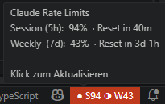

# Claude Usage Statusbar

<p align="center">
  
</p>

Zeigt deine **Claude Code Rate-Limit-Nutzung** (Session 5h & Weekly 7d) direkt in der VS Code Statusleiste.

<p align="center">
  
</p>

## Wie es funktioniert

Die Extension liest die gespeicherten Claude-Zugangsdaten aus `~/.claude/.credentials.json` und ruft alle 5 Minuten `/api/oauth/usage` direkt ab. Als Fallback überwacht sie `~/.claude/usage-bar-data.json` für Daten aus Terminal-Claude-Sitzungen. Ein Klick auf die Statusleiste aktualisiert sofort.

## Statusleiste

| Anzeige | Bedeutung |
|---|---|
| `✦` | Noch keine Daten |
| `◑ S42` | Session 42% (Halbkreis = 26–50%) |
| `◑ S42 ◕ W75` | Session + Weekly |
| Gelber Hintergrund | ≥ 70% |
| Roter Hintergrund | ≥ 90% |

Die Kreissymbole zeigen den Füllstand: ○ (0%) · ◔ (1–25%) · ◑ (26–50%) · ◕ (51–75%) · ● (76–100%)

Der Tooltip zeigt genaue Prozentwerte und die verbleibende Zeit bis zum Reset.

## Installation (als .vsix-Datei)

1. Die `.vsix`-Datei aus den [Releases](../../releases) herunterladen
2. In VS Code: `Strg+Shift+P` → **Extensions: Install from VSIX...**
3. Datei auswählen – fertig

Oder per Terminal:
```bash
code --install-extension claude-usage-statusbar-0.2.0.vsix
```

## Selbst bauen

```bash
git clone https://github.com/dipser/claude-usage-statusbar
cd claude-usage-statusbar
npm install
npm run compile
npm run package    # erzeugt .vsix-Datei
```

## Voraussetzungen

- [Claude Code VS Code Extension](https://claude.ai/download) installiert und eingeloggt
- VS Code 1.80+

## Lizenz

MIT
